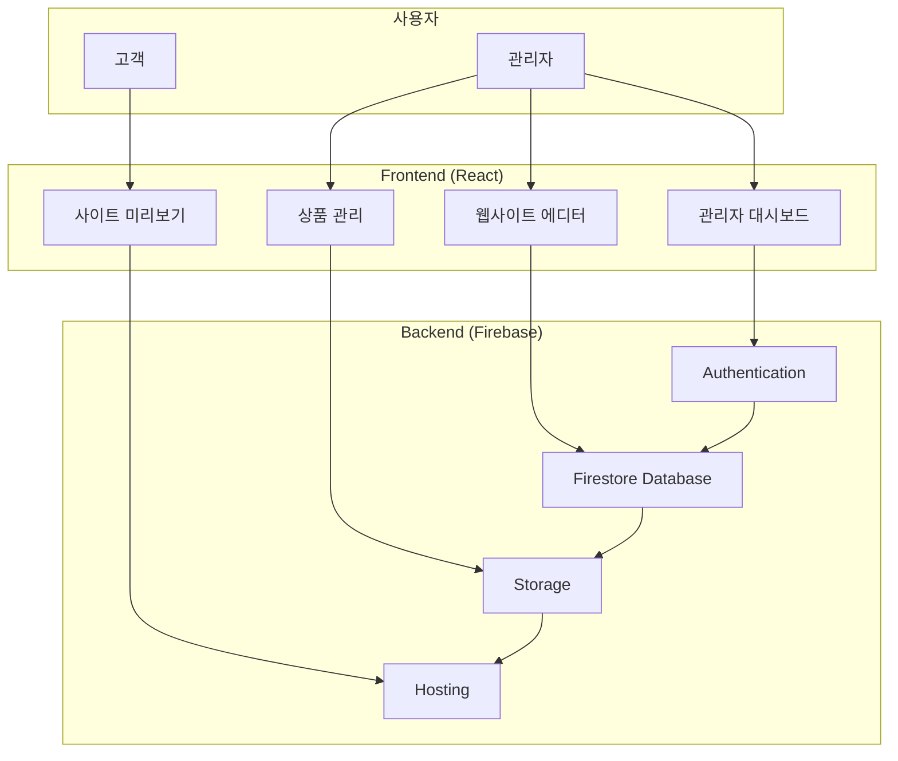
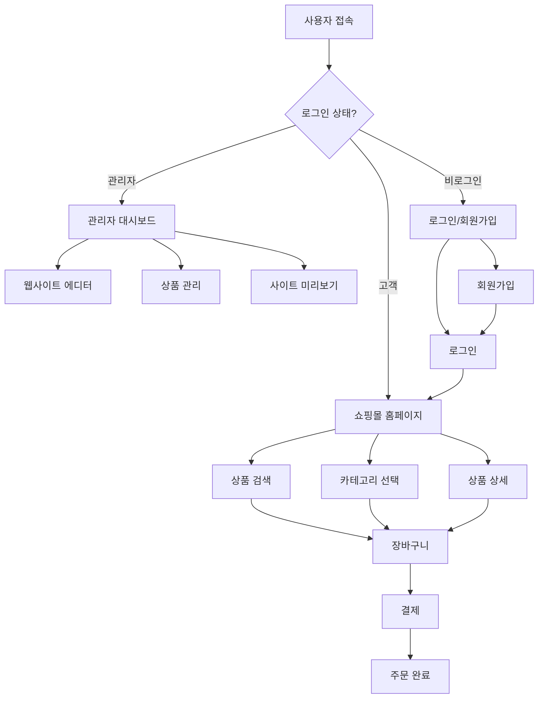
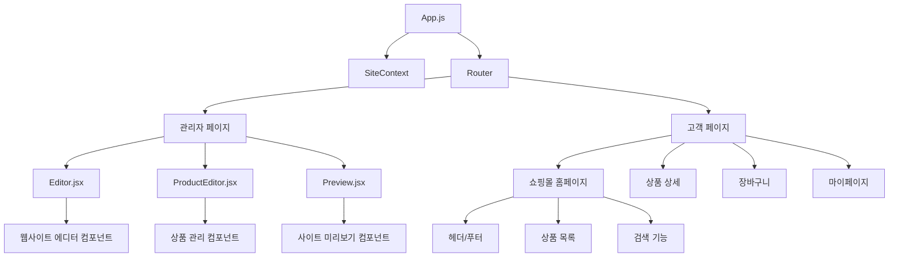
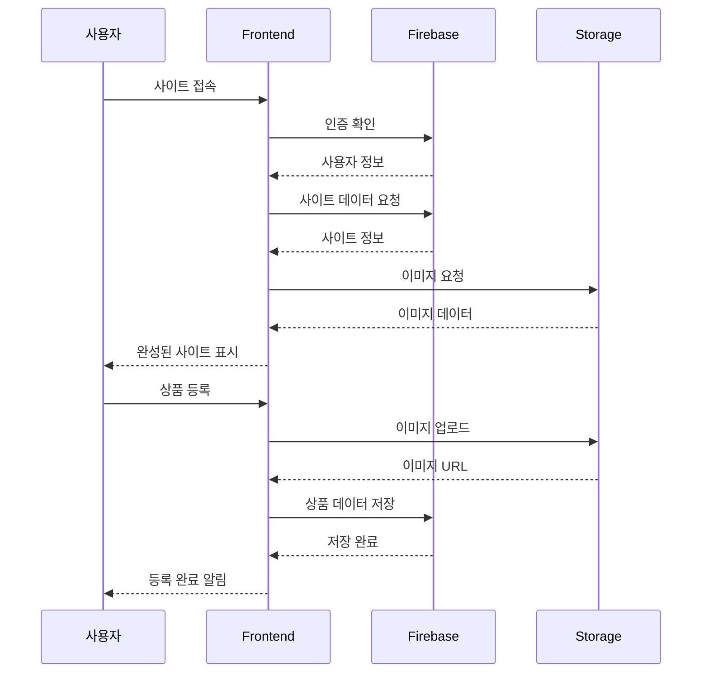
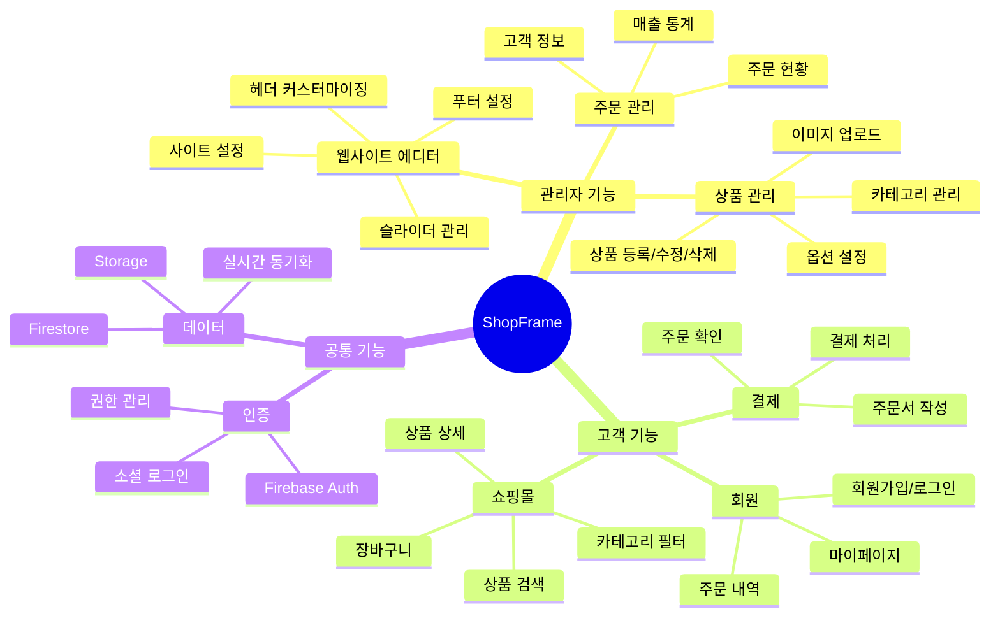
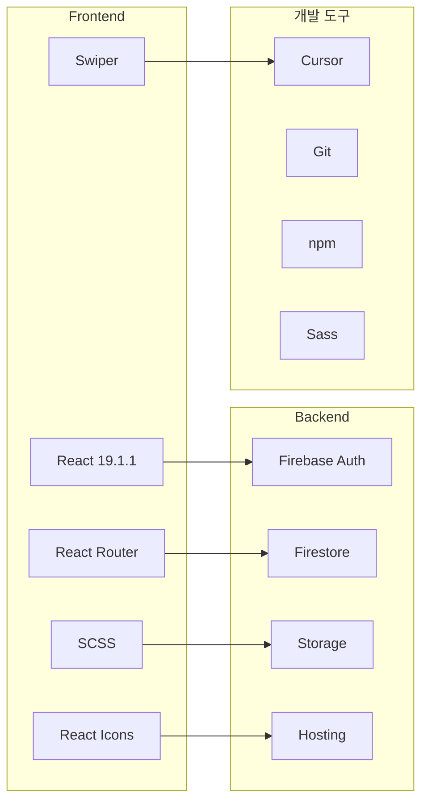
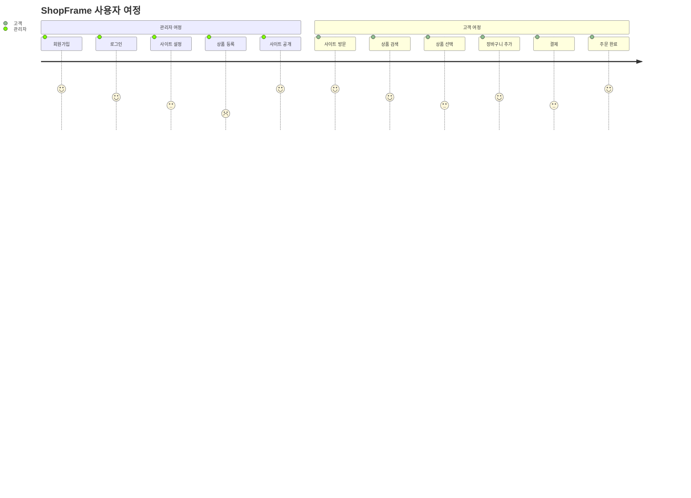
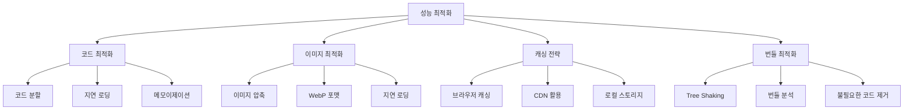
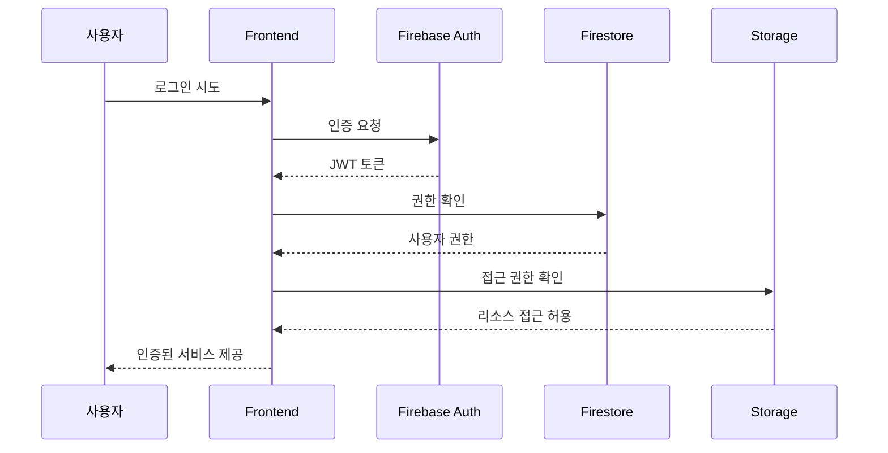
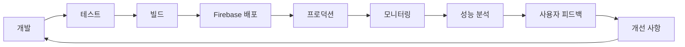

# ShopFrame 발표자료 - 시각적 다이어그램

## 1. 시스템 아키텍처 다이어그램

## 2. 사용자 플로우 다이어그램

## 3. 컴포넌트 구조 다이어그램

## 4. 데이터 플로우 다이어그램

## 5. 기능별 모듈 구조

## 6. 기술 스택 다이어그램

## 7. 사용자 여정 맵

## 8. 성능 최적화 전략

## 9. 보안 및 인증 플로우

## 10. 배포 및 운영 플로우

---

## 다이어그램 사용 가이드

### PowerPoint에서 사용하는 방법:
1. 각 다이어그램을 개별 슬라이드로 복사
2. Mermaid 다이어그램을 이미지로 변환
3. 발표 내용에 맞게 슬라이드에 삽입

### 발표 시 활용:
- **시스템 아키텍처**: 기술적 구조 설명
- **사용자 플로우**: UX/UI 설계 근거
- **컴포넌트 구조**: 개발 과정 설명
- **데이터 플로우**: 실시간 동작 원리
- **기능별 모듈**: 전체 기능 개요
- **기술 스택**: 사용 기술 설명
- **사용자 여정**: 사용자 경험 설계
- **성능 최적화**: 기술적 성과
- **보안 인증**: 안전성 확보
- **배포 운영**: 실제 서비스 운영
